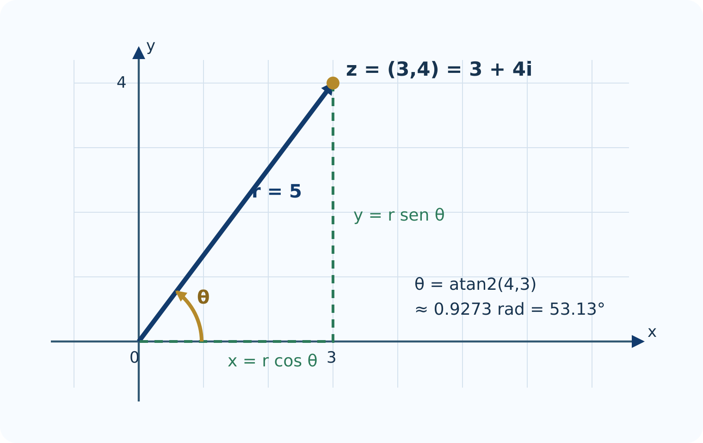
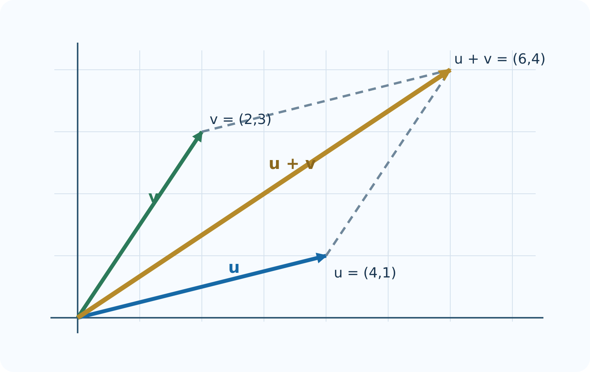
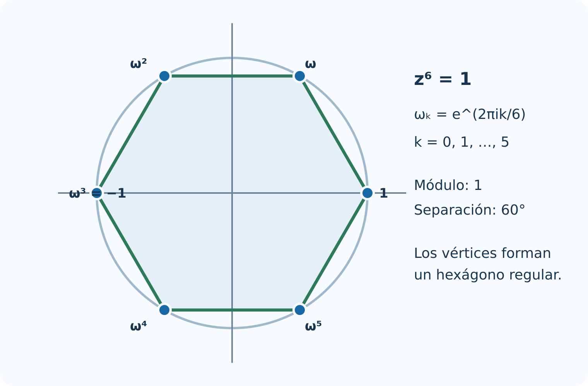

# Números complejos

## Introducción {.unnumbered .unlisted}

Los números complejos unen álgebra y geometría. En forma cartesiana se operan mediante sus partes real e imaginaria; en forma polar, la multiplicación se convierte en una combinación de cambio de escala y rotación. R incorpora números complejos en su lenguaje base, por lo que permite experimentar sin instalar paquetes.

El capítulo sigue las nueve secciones de la Unidad 3 del programa oficial de Álgebra Superior de la Facultad de Ciencias de la UASLP [@uaslp2011]. Cada sección comienza con el procedimiento manual, lo traduce a R y termina con una interpretación geométrica.

### Objetivos {.unnumbered .unlisted}

Al terminar, el estudiante podrá:

- representar pares, vectores y complejos en el plano;
- convertir coordenadas cartesianas y polares;
- programar operaciones vectoriales con R base;
- utilizar Re(), Im(), Mod(), Arg() y Conj();
- interpretar sumas, productos, conjugados y cocientes;
- calcular potencias y todas las raíces de un complejo;
- comprobar resultados numéricamente sin confundir una prueba experimental con una demostración.

## Definición de $\mathbb R^2$ {#sec-r2}

Un elemento de $\mathbb R^2$ es un par ordenado $(x,y)$. Puede representar un punto o el vector dirigido desde el origen hasta ese punto.

### Situación inicial {.unnumbered .unlisted}

Un robot se desplaza $3$ unidades al este y $4$ al norte. Su posición final es $(3,4)$ y la distancia al origen es

$$
\sqrt{3^2+4^2}=5.
$$

En R, un vector de dos componentes puede guardarse como un vector numérico.

```{.r}
p <- c(x = 3, y = 4)
p
sqrt(sum(p^2))
```

Para varios puntos conviene usar un data.frame.

```{.r}
puntos <- data.frame(
  nombre = c("A", "B", "C", "D"),
  x = c(3, -2, -3, 2),
  y = c(4, 3, -2, -3)
)

puntos$cuadrante <- with(puntos, ifelse(
  x > 0 & y > 0, "I",
  ifelse(x < 0 & y > 0, "II",
         ifelse(x < 0 & y < 0, "III", "IV"))
))
puntos
```

### Plano cartesiano en R {.unnumbered .unlisted}

```{.r}
plot(puntos$x, puntos$y,
     xlim = c(-5, 5), ylim = c(-5, 5), asp = 1,
     xlab = "x", ylab = "y", pch = 19, col = "#1769a6",
     main = "Puntos de R²")
abline(h = 0, v = 0, col = "gray65")
text(puntos$x, puntos$y, labels = puntos$nombre,
     pos = 3, col = "#123b6d")
```

### Distancia entre dos puntos {.unnumbered .unlisted}

```{.r}
distancia <- function(P, Q) sqrt(sum((P - Q)^2))

P <- c(-2, 3)
Q <- c(4, -1)
distancia(P, Q)
```

::: {.callout-note title="Interpretación"}
El código reproduce la definición. P - Q obtiene las diferencias de componentes, ^2 calcula sus cuadrados, sum() los suma y sqrt() extrae la raíz.
:::

## Representaciones cartesiana y polar de vectores en $\mathbb R^2$ {#sec-cartesiana-polar}

Para $(x,y)\neq(0,0)$:

$$
r=\sqrt{x^2+y^2},\qquad
\theta=\operatorname{atan2}(y,x).
$$

La función de dos argumentos atan2(y, x) identifica el cuadrante correcto. La función atan(y/x) no lo hace en todos los casos.

{#fig-plano-complejo width=78%}

### Conversión cartesiana a polar {.unnumbered .unlisted}

```{.r}
cartesiana_polar <- function(x, y) {
  r <- sqrt(x^2 + y^2)
  theta <- ifelse(r == 0, NA_real_, atan2(y, x))
  data.frame(x = x, y = y, r = r,
             theta_rad = theta,
             theta_grados = theta * 180 / pi)
}

cartesiana_polar(3, 4)
cartesiana_polar(-sqrt(3), 1)
cartesiana_polar(0, 0)
```

### Conversión polar a cartesiana {.unnumbered .unlisted}

```{.r}
polar_cartesiana <- function(r, theta) {
  if (any(r < 0)) stop("El radio debe ser no negativo")
  data.frame(r = r, theta = theta,
             x = r * cos(theta),
             y = r * sin(theta))
}

polar_cartesiana(2, 5 * pi / 6)
```

### Construcción equivalente en GeoGebra {.unnumbered .unlisted}

En la vista gráfica pueden escribirse las órdenes:

~~~text
O = (0, 0)
Z = (3, 4)
u = Vector(O, Z)
r = Length(u)
theta = Angle((1, 0), u)
```

Al arrastrar $Z$, GeoGebra actualiza simultáneamente sus coordenadas, módulo y argumento.

::: {.content-visible when-format="html"}
### Laboratorio: coordenadas y argumento {.unnumbered .unlisted}

<iframe class="interactive-frame complex-plane" src="interactivos/plano-complejo.html" title="Laboratorio de representación cartesiana y polar"></iframe>

[Abrir el laboratorio en una pestaña nueva](interactivos/plano-complejo.html){.btn .btn-primary}
:::

## Operaciones con vectores en $\mathbb R^2$ {#sec-operaciones-r2}

Sean $\mathbf u=(u_1,u_2)$ y $\mathbf v=(v_1,v_2)$. La suma, resta, multiplicación por escalar y producto punto se calculan componente a componente.

```{.r}
u <- c(2, 1)
v <- c(-1, 2)

list(
  suma = u + v,
  resta = u - v,
  triple_u = 3 * u,
  producto_punto = sum(u * v)
)
```

Como sum(u * v) vale cero, los vectores son perpendiculares.

### Regla del paralelogramo {.unnumbered .unlisted}

{#fig-suma-vectores width=78%}

```{.r}
dibujar_suma <- function(u, v) {
  s <- u + v
  limites_x <- range(c(0, u[1], v[1], s[1])) + c(-1, 1)
  limites_y <- range(c(0, u[2], v[2], s[2])) + c(-1, 1)
  plot(0, 0, type = "n", xlim = limites_x, ylim = limites_y,
       asp = 1, xlab = "x", ylab = "y",
       main = "Suma vectorial")
  abline(h = 0, v = 0, col = "gray75")
  arrows(0, 0, u[1], u[2], length = 0.09,
         col = "#1769a6", lwd = 3)
  arrows(0, 0, v[1], v[2], length = 0.09,
         col = "#2c7a5a", lwd = 3)
  arrows(0, 0, s[1], s[2], length = 0.09,
         col = "#b58a2a", lwd = 3)
  segments(u[1], u[2], s[1], s[2], lty = 2, col = "gray45")
  segments(v[1], v[2], s[1], s[2], lty = 2, col = "gray45")
}

dibujar_suma(c(3, 1), c(1, 2))
```

### Verificación de propiedades {.unnumbered .unlisted}

Los cálculos con punto flotante deben compararse con tolerancia.

```{.r}
iguales_vectores <- function(a, b, tol = 1e-12) {
  length(a) == length(b) && all(abs(a - b) < tol)
}

w <- c(-2, 4)
lambda <- 2.5

c(
  conmutativa = iguales_vectores(u + v, v + u),
  asociativa = iguales_vectores((u + v) + w, u + (v + w)),
  distributiva = iguales_vectores(lambda * (u + v),
                                  lambda * u + lambda * v)
)
```

## Módulo y argumento {#sec-modulo-argumento}

En el plano complejo se escribe

$$
|z|=\sqrt{x^2+y^2},\qquad \arg(z)=\theta.
$$

R calcula estas cantidades con Mod() y Arg().

```{.r}
z <- 3 + 4i
c(modulo = Mod(z),
  argumento_rad = Arg(z),
  argumento_grados = Arg(z) * 180 / pi)
```

### Argumento principal y ángulos equivalentes {.unnumbered .unlisted}

```{.r}
z_cuadrantes <- c(1 + 1i, -1 + 1i, -1 - 1i, 1 - 1i)
data.frame(
  z = z_cuadrantes,
  argumento_rad = Arg(z_cuadrantes),
  argumento_grados = Arg(z_cuadrantes) * 180 / pi
)
```

Arg() devuelve el argumento principal en el intervalo $(-\pi,\pi]$. A cada resultado se le puede sumar $2k\pi$ sin cambiar el punto.

::: {.callout-warning title="El argumento de cero"}
R devuelve `Arg(0) = 0` por conveniencia computacional. Matemáticamente, el argumento de $0$ no está definido porque el vector nulo no señala ninguna dirección. La función `cartesiana_polar()` registra este caso como `NA`.
:::

### Desigualdad triangular: experimento reproducible {.unnumbered .unlisted}

```{.r}
set.seed(314)
z <- complex(real = runif(1000, -5, 5),
             imaginary = runif(1000, -5, 5))
w <- complex(real = runif(1000, -5, 5),
             imaginary = runif(1000, -5, 5))

holgura <- Mod(z) + Mod(w) - Mod(z + w)
summary(holgura)
all(holgura >= -1e-12)
```

::: {.callout-warning title="Alcance de la comprobación"}
Mil casos correctos apoyan la propiedad y ayudan a detectar errores, pero no demuestran que sea verdadera para todos los complejos. La demostración general aparece en el volumen de Fundamentos Matemáticos.
:::

## Números imaginarios y complejos {#sec-imaginarios-complejos}

R reconoce un literal complejo cuando aparece el sufijo i. Debe escribirse 1i, no solamente i, a menos que antes se haya creado un objeto con ese nombre.

```{.r}
z <- 3 + 4i
typeof(z)

c(
  parte_real = Re(z),
  parte_imaginaria = Im(z),
  modulo = Mod(z),
  argumento = Arg(z)
)
```

### Construcción desde componentes {.unnumbered .unlisted}

```{.r}
z1 <- 3 + 4i
z2 <- complex(real = 3, imaginary = 4)
z3 <- as.complex(3) + 4i

c(z1 = z1, z2 = z2, z3 = z3)
identical(z1, z2)
```

### Vector de números complejos {.unnumbered .unlisted}

```{.r}
zs <- c(2 + 1i, -1 + 3i, -2 - 2i, 3 - 1i)
tabla_z <- data.frame(
  z = zs,
  real = Re(zs),
  imaginaria = Im(zs),
  modulo = Mod(zs),
  argumento = Arg(zs)
)
tabla_z
```

### Plano complejo en R {.unnumbered .unlisted}

```{.r}
plot(Re(zs), Im(zs), asp = 1, pch = 19,
     xlab = "Parte real", ylab = "Parte imaginaria",
     col = "#1769a6", main = "Números complejos")
abline(h = 0, v = 0, col = "gray65")
text(Re(zs), Im(zs), labels = paste0("z", seq_along(zs)), pos = 3)
```

## Operaciones básicas con números complejos {#sec-operaciones-complejos}

### Solución manual {.unnumbered .unlisted}

Para $z=3-2i$ y $w=1+4i$:

$$
z+w=4+2i,
$$

$$
zw=(3)(1)-(-2)(4)+\bigl((3)(4)+(-2)(1)\bigr)i=11+10i.
$$

### Comprobación en R {.unnumbered .unlisted}

```{.r}
z <- 3 - 2i
w <- 1 + 4i

c(suma = z + w,
  resta = z - w,
  producto = z * w)
```

### Multiplicar significa rotar y escalar {.unnumbered .unlisted}

```{.r}
resumen_producto <- function(z, w) {
  producto <- z * w
  data.frame(
    cantidad = c("z", "w", "z*w"),
    modulo = c(Mod(z), Mod(w), Mod(producto)),
    argumento = c(Arg(z), Arg(w), Arg(producto))
  )
}

resumen_producto(2 * exp(1i * pi / 6),
                 1.5 * exp(1i * pi / 3))
```

La tabla permite comprobar

$$
|zw|=|z||w|,
\qquad
\arg(zw)\equiv\arg(z)+\arg(w)\pmod{2\pi}.
$$

::: {.content-visible when-format="html"}
### Laboratorio: producto como transformación {.unnumbered .unlisted}

<iframe class="interactive-frame complex-product" src="interactivos/multiplicacion-compleja.html" title="Laboratorio de multiplicación compleja"></iframe>

[Abrir el laboratorio en una pestaña nueva](interactivos/multiplicacion-compleja.html){.btn .btn-primary}
:::

## Complejo conjugado y sus propiedades {#sec-conjugado}

El conjugado de $z=a+bi$ es $\overline z=a-bi$. R lo calcula con Conj().

{#fig-conjugado-complejo width=72%}

```{.r}
z <- 3 + 4i

c(
  z = z,
  conjugado = Conj(z),
  producto = z * Conj(z),
  modulo_cuadrado = Mod(z)^2
)
```

### Comprobaciones vectorizadas {.unnumbered .unlisted}

```{.r}
z <- c(1 + 2i, -3 + 4i, 2 - 5i)
w <- c(2 - 1i, 1 + 3i, -4 + 2i)

c(
  involucion = all(Conj(Conj(z)) == z),
  suma = all(Conj(z + w) == Conj(z) + Conj(w)),
  producto = all(Conj(z * w) == Conj(z) * Conj(w)),
  modulo = all(abs(Mod(Conj(z)) - Mod(z)) < 1e-12)
)
```

### Recuperar las partes real e imaginaria {.unnumbered .unlisted}

```{.r}
z <- -2 + 7i
c(
  real_por_conjugado = (z + Conj(z)) / 2,
  imaginaria_por_conjugado = (z - Conj(z)) / (2i)
)
```

El segundo resultado es el número real $7$, no $7i$, porque la fórmula calcula $\operatorname{Im}(z)$.

## División de complejos {#sec-division-complejos}

### Procedimiento manual {.unnumbered .unlisted}

$$
\frac{2+3i}{1-2i}
=\frac{(2+3i)(1+2i)}{1^2+(-2)^2}
=-\frac45+\frac75i.
$$

### Cálculo y verificación en R {.unnumbered .unlisted}

```{.r}
z <- 2 + 3i
w <- 1 - 2i
cociente <- z / w

c(cociente = cociente,
  comprobacion = cociente * w,
  error = Mod(cociente * w - z))
```

### Programar la fórmula cartesiana {.unnumbered .unlisted}

```{.r}
dividir_complejos <- function(z, w) {
  if (any(Mod(w) == 0)) stop("No se puede dividir entre cero")
  z * Conj(w) / Mod(w)^2
}

dividir_complejos(2 + 3i, 1 - 2i)
```

### Comparación polar {.unnumbered .unlisted}

```{.r}
resumen_cociente <- function(z, w) {
  q <- z / w
  data.frame(
    calculo = c("|z|/|w|", "|z/w|",
                "Arg(z)-Arg(w)", "Arg(z/w)"),
    valor = c(Mod(z) / Mod(w), Mod(q),
              Arg(z) - Arg(w), Arg(q))
  )
}

resumen_cociente(2 + 3i, 1 - 2i)
```

Los dos argumentos pueden diferir en un múltiplo de $2\pi$ y representar la misma dirección.

## Potencias y raíces de complejos {#sec-potencias-raices}

### Potencias con De Moivre {.unnumbered .unlisted}

```{.r}
potencia_demoivre <- function(z, n) {
  if (z == 0 && n < 0) stop("Cero no admite exponentes negativos")
  Mod(z)^n * exp(1i * n * Arg(z))
}

z <- 1 + 1i
c(R = z^8,
  De_Moivre = potencia_demoivre(z, 8),
  diferencia = Mod(z^8 - potencia_demoivre(z, 8)))
```

R utiliza la identidad de Euler

$$
e^{i\theta}=\cos\theta+i\sin\theta.
$$

Por eso r * exp(1i * theta) es una forma compacta de construir un complejo polar.

### Todas las raíces $n$-ésimas {.unnumbered .unlisted}

```{.r}
raices_n <- function(z, n) {
  if (length(z) != 1L || length(n) != 1L || n < 1 || n != floor(n)) {
    stop("Use un complejo y un entero positivo n")
  }
  if (z == 0) return(0 + 0i)
  k <- 0:(n - 1)
  Mod(z)^(1 / n) * exp(1i * (Arg(z) + 2 * pi * k) / n)
}

raices_cubicas <- raices_n(-8, 3)
raices_cubicas
raices_cubicas^3
```

### Raíces de la unidad {.unnumbered .unlisted}

```{.r}
raices_unidad <- function(n) exp(2 * pi * 1i * (0:(n - 1)) / n)

omega <- raices_unidad(6)
round(omega, 10)
```

{#fig-raices-unidad width=72%}

```{.r}
plot(Re(omega), Im(omega), asp = 1, pch = 19,
     xlim = c(-1.25, 1.25), ylim = c(-1.25, 1.25),
     xlab = "Parte real", ylab = "Parte imaginaria",
     col = "#1769a6", main = "Raíces sextas de la unidad")
abline(h = 0, v = 0, col = "gray75")
segments(Re(omega), Im(omega),
         Re(c(omega[-1], omega[1])), Im(c(omega[-1], omega[1])),
         col = "#2c7a5a", lwd = 2)
text(Re(omega), Im(omega), labels = paste0("k=", 0:5), pos = 3)
```

::: {.content-visible when-format="html"}
### Laboratorio: raíces de la unidad {.unnumbered .unlisted}

<iframe class="interactive-frame unity-roots" src="interactivos/raices-unidad.html" title="Laboratorio de raíces de la unidad"></iframe>

[Abrir el laboratorio en una pestaña nueva](interactivos/raices-unidad.html){.btn .btn-primary}
:::

## Laboratorio del capítulo {.unnumbered .unlisted}

Trabaje en este orden:

1. elija un punto en el laboratorio cartesiano-polar y anote $x$, $y$, $r$ y $\theta$;
2. compruebe manualmente $r=\sqrt{x^2+y^2}$;
3. use el laboratorio de multiplicación para observar la suma de argumentos;
4. reproduzca el mismo ejemplo con R;
5. cambie $n$ en el laboratorio de raíces y describa el polígono obtenido;
6. compruebe en R que cada punto elevado a $n$ produce $1$ dentro de la tolerancia numérica.

::: {.content-visible when-format="html"}
[Abrir el cuaderno completo del capítulo 3 en Google Colab](https://colab.research.google.com/github/gilbertorodriguez59/libro-algebra-superior-r-geogebra/blob/main/notebooks/capitulo-03-numeros-complejos-R.ipynb){.btn .btn-primary}

[Descargar el cuaderno](notebooks/capitulo-03-numeros-complejos-R.ipynb){.btn}
:::

## Ejercicios con R {.unnumbered .unlisted}

1. Escriba una función que reciba dos puntos de $\mathbb R^2$ y devuelva distancia y punto medio.
2. Genere veinte vectores aleatorios y conviértalos a forma polar.
3. Compare atan(Im(z)/Re(z)) con Arg(z) en los cuatro cuadrantes y explique las diferencias.
4. Escriba una función que clasifique un complejo como real, imaginario puro o complejo general.
5. Compruebe experimentalmente $|zw|=|z||w|$ con mil pares aleatorios.
6. Represente $z,\overline z,-z$ y $1/z$ para un mismo complejo no nulo.
7. Calcule $(1-i)^{20}$ directamente y mediante potencia_demoivre().
8. Obtenga las raíces quintas de $-32$ y verifique el residuo máximo $\max_k|w_k^5+32|$.
9. Dibuje las raíces de la unidad para $n=3,4,5,8,12$ en cinco paneles.
10. Modifique el gráfico de raíces para mostrar también los argumentos en grados.

## Proyecto integrador {.unnumbered .unlisted}

**Explorador de transformaciones complejas.** Desarrolle un script en R base que:

1. reciba un conjunto de puntos complejos;
2. aplique $T(z)=az+b$ con parámetros elegidos por el usuario;
3. muestre los puntos originales y transformados en la misma escala;
4. separe el efecto de $az$ en rotación y cambio de escala;
5. interprete el efecto de la traslación $b$;
6. incluya al menos una figura formada por los vértices de un polígono;
7. compruebe numéricamente dos propiedades del módulo o del conjugado;
8. entregue código, gráfica, explicación matemática y conclusiones.

## Síntesis {.unnumbered .unlisted}

- Un par de $\mathbb R^2$ se almacena como vector; una colección, como tabla.
- atan2(y, x) y Arg(z) resuelven correctamente el cuadrante.
- R representa complejos con el tipo complex y el literal 1i.
- Re(), Im(), Mod(), Arg() y Conj() traducen directamente las definiciones.
- La suma es vectorial; el producto combina escala y rotación.
- El conjugado permite dividir y visualizar una reflexión.
- exp(1i * theta) simplifica la forma polar, De Moivre y las raíces.
- Las comparaciones numéricas deben usar tolerancia.

## Referencias del capítulo {.unnumbered .unlisted}

La organización matemática sigue @uaslp2011 y @silvaLazo2007. La interpretación geométrica se apoya en @brownChurchill2014 y @needham1997. Las funciones y la sintaxis computacional corresponden a R base [@rCore2026].
