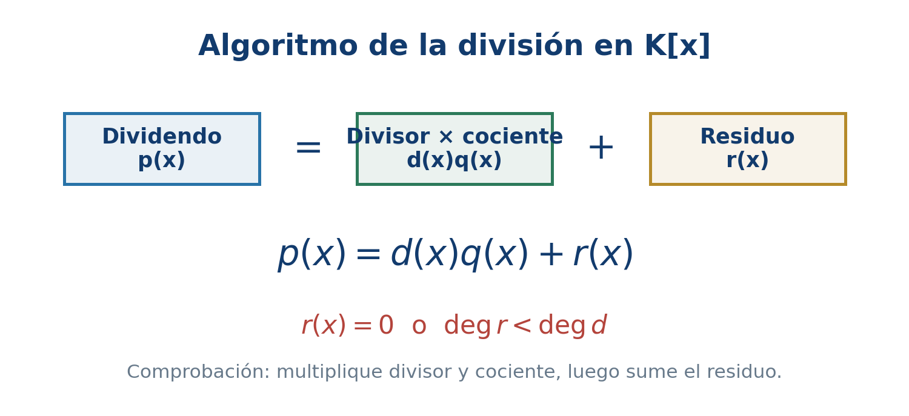
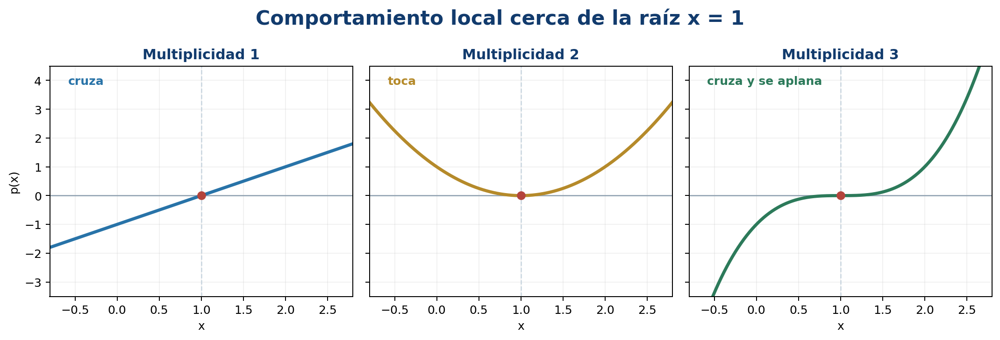
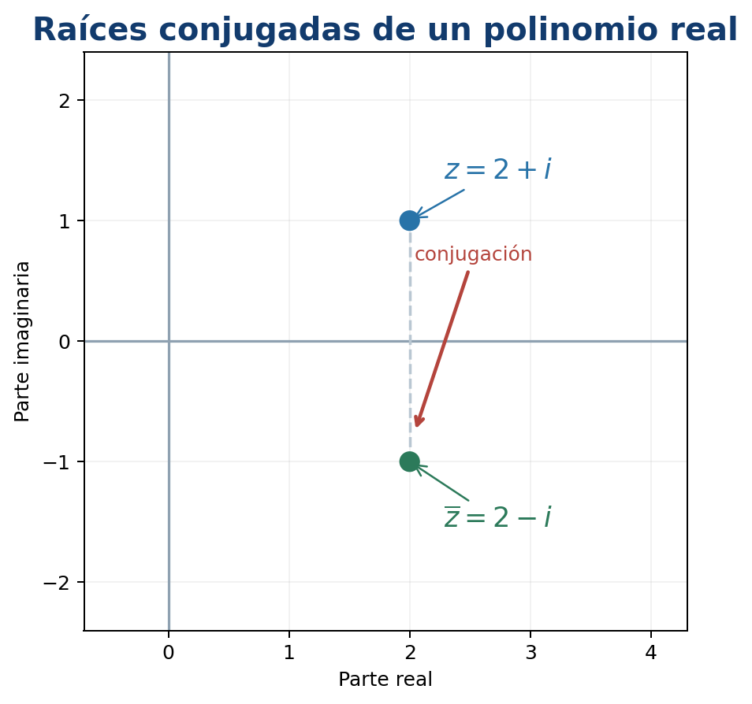
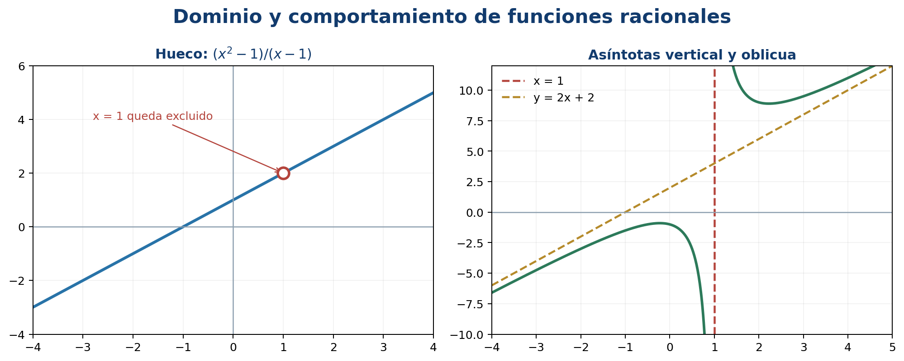

# Polinomios

Este capítulo desarrolla la Unidad 4 del programa oficial de Álgebra Superior de la Facultad de Ciencias de la UASLP [@uaslp2011]. El propósito es pasar de las operaciones formales con polinomios a la comprensión de sus raíces, su factorización y las funciones racionales.

## Introducción {.unnumbered .unlisted}

Los polinomios aparecen al modelar trayectorias, señales, costos, aproximaciones y ecuaciones. Tienen una doble naturaleza: son expresiones algebraicas que pueden sumarse y multiplicarse, y también funciones cuyos ceros se observan en una gráfica. La división conecta ambas perspectivas: una raíz produce un factor y un factor produce una raíz.

### Objetivos del capítulo {.unnumbered .unlisted}

Al terminar el capítulo, el lector podrá:

- identificar coeficientes, grado y coeficiente principal;
- efectuar operaciones y justificar sus propiedades;
- aplicar el algoritmo de la división en $K[x]$;
- relacionar raíces, factores y residuos;
- usar división sintética y detectar raíces múltiples;
- explicar el alcance del teorema fundamental del álgebra;
- factorizar sobre $\mathbb C$ y sobre $\mathbb R$;
- analizar dominio, ceros, discontinuidades y asíntotas de funciones racionales;
- descomponer fracciones racionales en fracciones parciales.

## Materiales complementarios del capítulo

### Video del capítulo

El enlace al video se incorporará cuando esté disponible.

| Material | Descripción | Acceso |
|---|---|---|
| Presentación en PDF | Diapositivas del capítulo para consulta y exposición. | Enlace pendiente |
| Presentación editable | Diapositivas en formato PowerPoint. | Enlace pendiente |
| Infografía | Síntesis visual de los conceptos principales. | Enlace pendiente |
| Cuaderno de Google Colab | Cuaderno completo del capítulo con código y ejercicios en R. | [Abrir en Google Colab](https://colab.research.google.com/github/gilbertorodriguez59/libro-algebra-superior-r-geogebra/blob/main/notebooks/capitulo-04-polinomios-R.ipynb){target="_blank"} |

## Definición de polinomio {#sec-definicion-polinomio}

Sea $K$ un campo, normalmente $\mathbb Q$, $\mathbb R$ o $\mathbb C$.

::: {.callout-note title="Definición"}
Un polinomio en la variable $x$ con coeficientes en $K$ es una expresión

$$
p(x)=a_0+a_1x+\cdots+a_nx^n,
\qquad a_j\in K,
$$

en la que solo un número finito de coeficientes es distinto de cero. El conjunto de todos ellos se denota por $K[x]$.
:::

Si $p\ne0$ y $a_n\ne0$, el **grado** de $p$ es $\deg p=n$, $a_n$ es el coeficiente principal y $a_0$ el término independiente. Un polinomio es **mónico** cuando su coeficiente principal es $1$. Por convenio, al polinomio cero no se le asigna un grado ordinario; a veces se escribe $\deg 0=-\infty$ para conservar algunas fórmulas.

::: {.callout-tip title="Ejemplo"}
En

$$
p(x)=-2x^5+3x^2-7
$$

los coeficientes omitidos son cero, el grado es $5$, el coeficiente principal es $-2$ y el término independiente es $-7$.
:::

### Igualdad y evaluación {.unnumbered .unlisted}

Dos polinomios son iguales si tienen el mismo coeficiente en cada potencia de $x$. Por ejemplo,

$$
(x+1)^2=x^2+2x+1
$$

como polinomios, porque al desarrollar coinciden todos sus coeficientes.

La evaluación en $c\in K$ es

$$
p(c)=a_0+a_1c+\cdots+a_nc^n.
$$

No debe confundirse el polinomio formal con la función que induce. Sobre campos infinitos, como $\mathbb R$ y $\mathbb C$, dos polinomios que dan el mismo valor para todo $x$ tienen los mismos coeficientes. Sobre un campo finito pueden existir polinomios distintos que representan la misma función.

## Aritmética y propiedades de los polinomios {#sec-aritmetica-polinomios}

Para sumar polinomios se suman coeficientes de términos del mismo grado. Para multiplicarlos se aplica la distributividad y se agrupan potencias iguales.

Sean

$$
p(x)=\sum_{j=0}^{m}a_jx^j,
\qquad
q(x)=\sum_{k=0}^{n}b_kx^k.
$$

Entonces

$$
p(x)+q(x)=\sum_{r\ge0}(a_r+b_r)x^r
$$

y

$$
p(x)q(x)=\sum_{r=0}^{m+n}
\left(\sum_{j+k=r}a_jb_k\right)x^r.
$$

La suma interior es una **convolución** de las sucesiones de coeficientes.

::: {.callout-tip title="Ejemplo resuelto"}
Si $p(x)=2x^2-x+3$ y $q(x)=x^2+4x-1$, entonces

$$
p+q=3x^2+3x+2,
$$

$$
pq=2x^4+7x^3-3x^2+13x-3.
$$
:::

### Propiedades de grado {.unnumbered .unlisted}

Para polinomios no nulos sobre un campo:

$$
\deg(pq)=\deg p+\deg q,
$$

$$
\deg(p+q)\leq\max\{\deg p,\deg q\}.
$$

En la suma puede disminuir el grado si se cancelan los términos principales. Por ejemplo, $(x^3+1)+(-x^3+x)=x+1$.

Con la suma y el producto, $K[x]$ es un anillo conmutativo con identidad. No es un campo: un polinomio no constante no tiene inverso polinomial. Sus unidades son precisamente las constantes no nulas.

## Divisibilidad {#sec-divisibilidad-polinomios}

::: {.callout-note title="Definición"}
Dados $p,d\in K[x]$, con $d\ne0$, se dice que $d$ divide a $p$, y se escribe $d\mid p$, si existe $q\in K[x]$ tal que

$$
p=dq.
$$
:::

El resultado fundamental es análogo al algoritmo de la división de enteros.

::: {.callout-important title="Algoritmo de la división"}
Para $p,d\in K[x]$, con $d\ne0$, existen polinomios únicos $q$ y $r$ tales que

$$
p=dq+r,
\qquad r=0\quad\text{o}\quad\deg r<\deg d.
$$
:::

El polinomio $q$ es el cociente y $r$ el residuo.

### Por qué termina el algoritmo {.unnumbered .unlisted}

Si $\deg p\geq\deg d$, se elige un monomio que cancele el término principal de $p$. Después de restar ese múltiplo de $d$, el grado disminuye. Como los grados son enteros no negativos, el proceso debe terminar.

### Ejemplo de división larga {.unnumbered .unlisted}

Dividamos

$$
p(x)=2x^4-3x^3+4x-5
$$

entre $d(x)=x^2-x+1$. El resultado es

$$
q(x)=2x^2-x-3,
\qquad r(x)=2x-2.
$$

La comprobación decisiva es

$$
2x^4-3x^3+4x-5
=(x^2-x+1)(2x^2-x-3)+(2x-2).
$$

{#fig-division-polinomios width=88% fig-alt="Esquema del algoritmo de división polinomial con dividendo, divisor, cociente y residuo."}

## Definición de raíz de un polinomio {#sec-raiz-polinomio}

::: {.callout-note title="Definición"}
Un número $\alpha\in K$ es raíz o cero de $p\in K[x]$ si

$$
p(\alpha)=0.
$$
:::

La conexión entre evaluación y divisibilidad es inmediata al dividir entre $x-\alpha$.

::: {.callout-important title="Teorema del factor"}
$\alpha$ es raíz de $p$ si y solo si $x-\alpha$ divide a $p$.
:::

En efecto, por el algoritmo de la división,

$$
p(x)=(x-\alpha)q(x)+r,
$$

donde $r$ es constante. Al evaluar en $x=\alpha$ se obtiene $r=p(\alpha)$. Por tanto, $p(\alpha)=0$ exactamente cuando el residuo es cero.

### Número máximo de raíces {.unnumbered .unlisted}

Un polinomio no nulo de grado $n$ tiene como máximo $n$ raíces distintas en un campo. La prueba es inductiva: cada raíz extrae un factor lineal y reduce el grado en uno.

::: {.callout-warning title="Una distinción esencial"}
Que un polinomio de grado $n$ tenga a lo sumo $n$ raíces no afirma que tenga $n$ raíces reales. Por ejemplo, $x^2+1$ no tiene raíces en $\mathbb R$, aunque sí tiene dos en $\mathbb C$.
:::

## Teorema del residuo y división sintética {#sec-residuo-sintetica}

::: {.callout-important title="Teorema del residuo"}
El residuo de dividir $p(x)$ entre $x-c$ es $p(c)$.
:::

Esto permite evaluar un polinomio sin completar toda la división. La **división sintética** organiza las operaciones solo con coeficientes.

### Ejemplo resuelto {.unnumbered .unlisted}

Para dividir

$$
p(x)=2x^3-3x^2-11x+6
$$

entre $x-3$, se usan los coeficientes $2,-3,-11,6$:

$$
\begin{array}{r|rrrr}
3&2&-3&-11&6\\
 & &6&9&-6\\ \hline
 &2&3&-2&0
\end{array}
$$

El cociente es $2x^2+3x-2$ y el residuo es $0$. En consecuencia,

$$
p(x)=(x-3)(2x^2+3x-2).
$$

::: {.callout-warning title="Coeficientes faltantes"}
En $x^4-5x^2+4$ deben escribirse los coeficientes $1,0,-5,0,4$. Omitir los ceros desplaza las columnas y cambia el resultado.
:::

### Evaluación de Horner {.unnumbered .unlisted}

La misma organización conduce a

$$
p(c)=(((a_nc+a_{n-1})c+a_{n-2})c+\cdots)c+a_0.
$$

El esquema de Horner necesita $n$ multiplicaciones y $n$ sumas, y evita calcular por separado todas las potencias de $c$.

## Obtención de raíces múltiples {#sec-raices-multiples}

::: {.callout-note title="Multiplicidad"}
Una raíz $\alpha$ tiene multiplicidad $m\geq1$ si

$$
p(x)=(x-\alpha)^m q(x),
\qquad q(\alpha)\ne0.
$$
:::

La raíz es simple cuando $m=1$, doble cuando $m=2$, triple cuando $m=3$, etcétera.

La derivada permite reconocer multiplicidades:

$$
\alpha\text{ tiene multiplicidad al menos }m
\iff
p(\alpha)=p'(\alpha)=\cdots=p^{(m-1)}(\alpha)=0.
$$

Si además $p^{(m)}(\alpha)\ne0$, la multiplicidad es exactamente $m$.

### Ejemplo {.unnumbered .unlisted}

Sea

$$
p(x)=(x-1)^3(x+2)^2.
$$

La raíz $1$ tiene multiplicidad $3$ y la raíz $-2$ multiplicidad $2$. En la gráfica, una raíz de multiplicidad par toca el eje y regresa; una raíz de multiplicidad impar lo cruza. Para multiplicidades impares mayores que uno, el cruce se aplana.

{#fig-multiplicidad-raices width=88% fig-alt="Tres gráficas comparan el comportamiento local de raíces simples, dobles y triples."}

::: {.callout-tip title="Procedimiento con divisiones sucesivas"}
Si $p(\alpha)=0$, divida entre $x-\alpha$. Vuelva a evaluar el cociente en $\alpha$ y repita. El número de divisiones exactas es la multiplicidad.
:::

## Teorema fundamental del álgebra {#sec-teorema-fundamental-algebra}

::: {.callout-important title="Teorema fundamental del álgebra"}
Todo polinomio no constante con coeficientes complejos posee al menos una raíz compleja.
:::

Aunque el enunciado garantiza una raíz, al dividir por su factor lineal y repetir se obtiene la forma completa:

$$
p(x)=a_n\prod_{j=1}^{n}(x-\alpha_j),
$$

donde las raíces se cuentan con multiplicidad.

### Alcance del teorema {.unnumbered .unlisted}

- Garantiza existencia, pero no proporciona por sí solo un algoritmo práctico para calcular las raíces.
- El campo $\mathbb C$ es algebraicamente cerrado.
- Un polinomio real puede no factorizarse completamente en factores lineales reales, pero sí en factores lineales complejos.
- Las fórmulas generales por radicales existen hasta grado cuatro; para grado cinco o mayor no existe una fórmula por radicales válida para todos los polinomios.

::: {.callout-warning title="No es un método numérico"}
El teorema fundamental del álgebra no dice que todas las raíces puedan escribirse con una fórmula elemental. La aproximación numérica será el tema del capítulo 5.
:::

## Descomposición de un polinomio en factores lineales {#sec-factorizacion-lineal}

Si $p\in\mathbb C[x]$ tiene grado $n\geq1$, entonces

$$
p(x)=a_n(x-\alpha_1)^{m_1}\cdots(x-\alpha_s)^{m_s},
$$

donde $\alpha_1,\ldots,\alpha_s$ son raíces distintas y

$$
m_1+\cdots+m_s=n.
$$

Esta factorización es única salvo por el orden de los factores.

### Ejemplo completo {.unnumbered .unlisted}

Factoricemos

$$
p(x)=x^4-5x^2+4.
$$

Al verlo como cuadrático en $u=x^2$:

$$
u^2-5u+4=(u-1)(u-4).
$$

Por tanto,

$$
p(x)=(x^2-1)(x^2-4)
=(x-1)(x+1)(x-2)(x+2).
$$

Las raíces son $-2,-1,1,2$, todas simples.

### Estrategia para coeficientes enteros {.unnumbered .unlisted}

Para un polinomio

$$
a_nx^n+\cdots+a_0
$$

con coeficientes enteros, toda raíz racional reducida $r/s$ satisface $r\mid a_0$ y $s\mid a_n$. Este **teorema de la raíz racional** produce candidatos; cada candidato debe evaluarse. No asegura que exista una raíz racional.

## Propiedades de polinomios con coeficientes reales {#sec-polinomios-reales}

Si $p$ tiene coeficientes reales, la conjugación conmuta con la evaluación:

$$
p(\overline z)=\overline{p(z)}.
$$

Por consiguiente, si $p(z)=0$, entonces

$$
p(\overline z)=\overline{0}=0.
$$

::: {.callout-important title="Raíces conjugadas"}
Las raíces complejas no reales de un polinomio con coeficientes reales aparecen en pares conjugados y con la misma multiplicidad.
:::

El producto de los factores conjugados tiene coeficientes reales:

$$
(x-z)(x-\overline z)
=x^2-2\operatorname{Re}(z)x+|z|^2.
$$

Así, todo polinomio real se factoriza sobre $\mathbb R$ como producto de factores lineales reales y factores cuadráticos irreducibles.

### Ejemplo {.unnumbered .unlisted}

Si $2+i$ es raíz de un polinomio real, también lo es $2-i$, y

$$
[x-(2+i)][x-(2-i)]=x^2-4x+5.
$$

{#fig-raices-conjugadas width=76% fig-alt="Dos raíces complejas conjugadas aparecen simétricas respecto del eje real."}

### Relaciones de Viète {.unnumbered .unlisted}

Para el polinomio mónico

$$
p(x)=x^n+a_{n-1}x^{n-1}+\cdots+a_0
=\prod_{j=1}^{n}(x-\alpha_j),
$$

se cumple, contando multiplicidades,

$$
\sum_{j=1}^{n}\alpha_j=-a_{n-1},
\qquad
\prod_{j=1}^{n}\alpha_j=(-1)^n a_0.
$$

## Funciones racionales {#sec-funciones-racionales}

::: {.callout-note title="Definición"}
Una función racional es un cociente

$$
R(x)=\frac{p(x)}{q(x)},
$$

donde $p,q\in K[x]$ y $q\ne0$. Su dominio excluye los ceros de $q$.
:::

Antes de simplificar debe registrarse el dominio original. Por ejemplo,

$$
R(x)=\frac{x^2-1}{x-1}=x+1,
\qquad x\ne1.
$$

La gráfica es la recta $y=x+1$ con un hueco en $(1,2)$. La simplificación algebraica no vuelve a incluir $x=1$.

### Ceros, polos y asíntotas {.unnumbered .unlisted}

- Los ceros provienen de factores del numerador que no se cancelan.
- Los ceros del denominador no cancelados producen polos y, usualmente, asíntotas verticales.
- Si $\deg p<\deg q$, la asíntota horizontal es $y=0$.
- Si $\deg p=\deg q$, la asíntota horizontal es el cociente de coeficientes principales.
- Si $\deg p\geq\deg q$, la división polinomial separa una parte polinomial y una fracción propia.

{#fig-funcion-racional width=88% fig-alt="Dos gráficas ilustran un hueco removible y una asíntota vertical en funciones racionales."}

::: {.callout-tip title="Ejemplo"}
Para

$$
R(x)=\frac{2x^2+1}{x-1},
$$

la división da

$$
R(x)=2x+2+\frac{3}{x-1}.
$$

Tiene asíntota vertical $x=1$ y asíntota oblicua $y=2x+2$.
:::

## Fracciones parciales {#sec-fracciones-parciales}

La descomposición en fracciones parciales expresa una fracción racional propia como suma de términos simples. Es útil para integrar, resolver ecuaciones diferenciales y transformar señales.

Primero, si $\deg p\geq\deg q$, se efectúa la división. Después se factoriza el denominador.

### Factores lineales distintos {.unnumbered .unlisted}

Si

$$
\frac{p(x)}{(x-a)(x-b)}
$$

es propia y $a\ne b$, se propone

$$
\frac{A}{x-a}+\frac{B}{x-b}.
$$

Por ejemplo,

$$
\frac{5x+1}{(x-1)(x+2)}
=\frac{2}{x-1}+\frac{3}{x+2}.
$$

La comprobación reúne el lado derecho sobre el denominador común.

### Factores lineales repetidos {.unnumbered .unlisted}

Para $(x-a)^m$ se requieren todos los términos

$$
\frac{A_1}{x-a}+\frac{A_2}{(x-a)^2}
+\cdots+\frac{A_m}{(x-a)^m}.
$$

### Factores cuadráticos irreducibles {.unnumbered .unlisted}

Por cada potencia $(x^2+bx+c)^m$ irreducible sobre $\mathbb R$ se incluyen numeradores lineales:

$$
\frac{A_1x+B_1}{x^2+bx+c}
+\cdots+
\frac{A_mx+B_m}{(x^2+bx+c)^m}.
$$

::: {.callout-tip title="Ejemplo mixto"}
La forma de descomposición para

$$
\frac{x^2+1}{(x-1)^2(x^2+4)}
$$

es

$$
\frac{A}{x-1}+\frac{B}{(x-1)^2}
+\frac{Cx+D}{x^2+4}.
$$

Los coeficientes se obtienen al multiplicar por el denominador común y comparar coeficientes o evaluar valores convenientes.
:::

## Síntesis del capítulo {.unnumbered .unlisted}

- $K[x]$ es un anillo de expresiones con un número finito de coeficientes no nulos.
- El algoritmo de la división escribe $p=dq+r$ con $\deg r<\deg d$.
- $p(c)$ es el residuo de dividir por $x-c$.
- $c$ es raíz si y solo si $x-c$ es factor.
- La multiplicidad cuenta cuántas veces aparece el factor lineal.
- Todo polinomio complejo no constante se descompone en factores lineales.
- En polinomios reales, las raíces no reales aparecen en pares conjugados.
- Una función racional conserva las exclusiones de su denominador original.
- Las fracciones parciales dependen de la factorización y multiplicidad del denominador.

## Errores frecuentes {.unnumbered .unlisted}

1. **Asignar grado al polinomio cero como si fuera ordinario.** Su grado se deja indefinido o se usa $-\infty$ por convenio.
2. **Olvidar términos ausentes.** En división sintética deben colocarse coeficientes cero.
3. **Confundir raíz con factor.** La raíz es un número; el factor correspondiente es $x-\alpha$.
4. **Creer que todo polinomio tiene raíces reales.** La garantía completa corresponde a $\mathbb C$.
5. **Contar solo raíces distintas.** El grado coincide con el número de raíces complejas cuando se cuentan multiplicidades.
6. **Cancelar un factor y ampliar el dominio.** Una discontinuidad removible sigue excluida del dominio original.
7. **Omitir términos en fracciones parciales.** Cada potencia repetida necesita su propio término.
8. **Usar una constante sobre un cuadrático irreducible.** El numerador debe tener grado menor, por lo que es lineal.

## Ejercicios {.unnumbered .unlisted}

### Nivel básico {.unnumbered .unlisted}

1. Indique grado, coeficiente principal y término independiente de $4x^6-3x^2+8$.
2. Sume y multiplique $p(x)=x^2-2x+3$ y $q(x)=2x+1$.
3. Evalúe $p(x)=2x^4-x^2+5x-7$ en $x=-2$ mediante Horner.
4. Divida $x^3-2x^2+4x-8$ entre $x-2$.
5. Determine si $-1$ es raíz de $x^4+3x^3-x-3$.
6. Factorice $x^4-16$ sobre $\mathbb R$ y sobre $\mathbb C$.
7. Determine el dominio de $(x^2-9)/(x-3)$ y describa el hueco.

### Nivel intermedio {.unnumbered .unlisted}

8. Divida $3x^5-2x^3+x-4$ entre $x^2+x-1$ y compruebe el resultado.
9. Use el teorema de la raíz racional para factorizar $2x^3-x^2-8x+4$.
10. Determine las multiplicidades de las raíces de $x^5-2x^4+x^3$.
11. Construya un polinomio real mónico de grado cuatro cuyas raíces sean $2$, $-1$ y $3+i$, $3-i$.
12. Use Viète para comprobar la suma y el producto de las raíces de $2x^3-3x^2-11x+6$.
13. Encuentre ceros, huecos y asíntotas de $(x^2-4)/(x^2-x-2)$.
14. Descomponga $(7x+5)/[(x-1)(x+3)]$ en fracciones parciales.

### Nivel formal y aplicado {.unnumbered .unlisted}

15. Demuestre la unicidad del cociente y el residuo en el algoritmo de la división.
16. Pruebe que un polinomio no nulo de grado $n$ tiene a lo sumo $n$ raíces distintas.
17. Demuestre que las raíces conjugadas de un polinomio real tienen la misma multiplicidad.
18. Determine la forma real más general de un polinomio de grado cinco con raíces $1$ doble y $2+3i$ simple.
19. Descomponga $(2x^3+x^2+4)/[(x-1)^2(x^2+1)]$ en fracciones parciales.
20. Diseñe un polinomio cuya gráfica cruce el eje en $x=-2$, toque el eje en $x=1$ y tenga grado mínimo.

## Proyecto integrador {.unnumbered .unlisted}

Elija un polinomio real de grado entre cuatro y seis y presente un estudio completo:

1. identifique grado y coeficientes;
2. localice candidatos racionales;
3. aplique división sintética;
4. determine todas las raíces y multiplicidades;
5. factorice sobre $\mathbb R$ y sobre $\mathbb C$;
6. compruebe dos relaciones de Viète;
7. construya una función racional usando el polinomio como numerador o denominador;
8. analice dominio, ceros, huecos y asíntotas;
9. obtenga, cuando corresponda, una descomposición en fracciones parciales;
10. acompañe los cálculos con una representación gráfica y conclusiones.

## Laboratorio computacional con R y GeoGebra {.unnumbered .unlisted}

Este laboratorio traduce las ideas del capítulo a algoritmos reproducibles. Los vectores de coeficientes se almacenan en orden descendente: $a_n,a_{n-1},\ldots,a_0$. Las funciones de R para raíces, en cambio, usan orden ascendente; esta diferencia se señala explícitamente.

### Representar y evaluar polinomios en R {.unnumbered .unlisted}

```{.r}
horner <- function(coeficientes, x) {
  acumulado <- 0
  for (a in coeficientes) acumulado <- acumulado * x + a
  acumulado
}

p <- c(2, -3, 0, 4, -5)  # 2x^4 - 3x^3 + 0x^2 + 4x - 5
horner(p, 2)
```

El cero en la tercera posición es indispensable: conserva el lugar del término $x^2$.

### Suma y producto por coeficientes {.unnumbered .unlisted}

```{.r}
rellenar_izquierda <- function(a, n) c(rep(0, n - length(a)), a)

sumar_polinomios <- function(a, b) {
  n <- max(length(a), length(b))
  rellenar_izquierda(a, n) + rellenar_izquierda(b, n)
}

multiplicar_polinomios <- function(a, b) {
  resultado <- numeric(length(a) + length(b) - 1)
  for (i in seq_along(a)) {
    for (j in seq_along(b)) {
      resultado[i + j - 1] <- resultado[i + j - 1] + a[i] * b[j]
    }
  }
  resultado
}

a <- c(2, -1, 3)  # 2x^2 - x + 3
b <- c(1, 4, -1)  # x^2 + 4x - 1
sumar_polinomios(a, b)
multiplicar_polinomios(a, b)
```

::: {.content-visible when-format="html"}
<p><a class="btn btn-primary" href="interactivos/operaciones-polinomios.html" target="_blank">Abrir GeoGebra: operaciones</a> <a class="btn" href="interactivos/geogebra/operaciones-polinomios.ggb" download>Descargar .ggb</a></p>
<iframe class="interactive-frame polynomial" src="interactivos/operaciones-polinomios.html" title="Operaciones con polinomios en GeoGebra" loading="lazy"></iframe>
:::

### División polinomial programada {.unnumbered .unlisted}

```{.r}
quitar_ceros_iniciales <- function(a, tolerancia = 1e-12) {
  while (length(a) > 1 && abs(a[1]) < tolerancia) a <- a[-1]
  a
}

dividir_polinomios <- function(dividendo, divisor, tolerancia = 1e-12) {
  dividendo <- quitar_ceros_iniciales(dividendo, tolerancia)
  divisor <- quitar_ceros_iniciales(divisor, tolerancia)
  if (length(divisor) == 1 && abs(divisor[1]) < tolerancia) {
    stop("El divisor no puede ser el polinomio cero")
  }
  if (length(dividendo) < length(divisor)) {
    return(list(cociente = 0, residuo = dividendo))
  }

  residuo <- dividendo
  cociente <- numeric(length(dividendo) - length(divisor) + 1)
  for (i in seq_along(cociente)) {
    factor <- residuo[i] / divisor[1]
    cociente[i] <- factor
    residuo[i:(i + length(divisor) - 1)] <-
      residuo[i:(i + length(divisor) - 1)] - factor * divisor
  }
  residuo[abs(residuo) < tolerancia] <- 0
  list(cociente = quitar_ceros_iniciales(cociente, tolerancia),
       residuo = quitar_ceros_iniciales(residuo, tolerancia))
}

dividir_polinomios(
  dividendo = c(2, -3, 0, 4, -5),
  divisor = c(1, -1, 1)
)
```

::: {.content-visible when-format="html"}
<p><a class="btn btn-primary" href="interactivos/division-residuo.html" target="_blank">Abrir GeoGebra: división y residuo</a> <a class="btn" href="interactivos/geogebra/division-residuo.ggb" download>Descargar .ggb</a></p>
<iframe class="interactive-frame polynomial" src="interactivos/division-residuo.html" title="División y residuo en GeoGebra" loading="lazy"></iframe>
:::

### División sintética y multiplicidad {.unnumbered .unlisted}

```{.r}
division_sintetica <- function(coeficientes, c) {
  salida <- numeric(length(coeficientes))
  salida[1] <- coeficientes[1]
  if (length(coeficientes) > 1) {
    for (j in 2:length(coeficientes)) {
      salida[j] <- coeficientes[j] + c * salida[j - 1]
    }
  }
  list(cociente = salida[-length(salida)], residuo = salida[length(salida)])
}

multiplicidad_raiz <- function(coeficientes, raiz, tolerancia = 1e-9) {
  actual <- coeficientes
  multiplicidad <- 0L
  repeat {
    paso <- division_sintetica(actual, raiz)
    if (abs(paso$residuo) > tolerancia || length(actual) == 1) break
    multiplicidad <- multiplicidad + 1L
    actual <- paso$cociente
  }
  multiplicidad
}

p <- c(1, 1, -5, -1, 8, -4)  # (x-1)^3 (x+2)^2
multiplicidad_raiz(p, 1)
multiplicidad_raiz(p, -2)
```

::: {.content-visible when-format="html"}
<p><a class="btn btn-primary" href="interactivos/raices-multiplicidad.html" target="_blank">Abrir GeoGebra: multiplicidad</a> <a class="btn" href="interactivos/geogebra/raices-multiplicidad.ggb" download>Descargar .ggb</a></p>
<iframe class="interactive-frame polynomial" src="interactivos/raices-multiplicidad.html" title="Raíces y multiplicidad en GeoGebra" loading="lazy"></iframe>
:::

### Todas las raíces y factorización {.unnumbered .unlisted}

La función `polyroot()` recibe coeficientes en orden ascendente. Por eso se aplica `rev()` al vector usado en las funciones anteriores.

```{.r}
p_desc <- c(1, 0, -5, 0, 4)  # x^4 - 5x^2 + 4
raices <- polyroot(rev(p_desc))
round(raices, 10)

# Verificación numérica mediante Horner
residuos <- vapply(raices, function(z) horner(p_desc, z), complex(1))
max(Mod(residuos))
```

El residuo máximo debe ser cercano a cero. Las pequeñas partes imaginarias que puedan aparecer al resolver un polinomio real son efecto del redondeo numérico.

::: {.content-visible when-format="html"}
<p><a class="btn btn-primary" href="interactivos/factorizacion-lineal.html" target="_blank">Abrir GeoGebra: factorización</a> <a class="btn" href="interactivos/geogebra/factorizacion-lineal.ggb" download>Descargar .ggb</a></p>
<iframe class="interactive-frame polynomial" src="interactivos/factorizacion-lineal.html" title="Factorización lineal en GeoGebra" loading="lazy"></iframe>
:::

### Pares conjugados {.unnumbered .unlisted}

```{.r}
z <- 2 + 1i
factor_real <- multiplicar_polinomios(
  c(1, -z),
  c(1, -Conj(z))
)
Re(factor_real)  # x^2 - 4x + 5
```

::: {.content-visible when-format="html"}
<p><a class="btn btn-primary" href="interactivos/raices-conjugadas.html" target="_blank">Abrir GeoGebra: raíces conjugadas</a> <a class="btn" href="interactivos/geogebra/raices-conjugadas.ggb" download>Descargar .ggb</a></p>
<iframe class="interactive-frame polynomial" src="interactivos/raices-conjugadas.html" title="Raíces conjugadas en GeoGebra" loading="lazy"></iframe>
:::

### Funciones racionales y fracciones parciales {.unnumbered .unlisted}

Para factores lineales distintos, los coeficientes de fracciones parciales pueden obtenerse resolviendo un sistema lineal. En el ejemplo

$$
\frac{5x+1}{(x-1)(x+2)}=\frac{A}{x-1}+\frac{B}{x+2},
$$

la identidad de numeradores es

$$
5x+1=A(x+2)+B(x-1).
$$

```{.r}
M <- matrix(c(1, 1,
              2, -1), nrow = 2, byrow = TRUE)
objetivo <- c(5, 1)
coeficientes <- solve(M, objetivo)
names(coeficientes) <- c("A", "B")
coeficientes

# Comprobación en varios puntos del dominio
x <- c(-4, -1, 0, 2, 5)
izquierda <- (5 * x + 1) / ((x - 1) * (x + 2))
derecha <- coeficientes["A"] / (x - 1) + coeficientes["B"] / (x + 2)
max(abs(izquierda - derecha))
```

::: {.content-visible when-format="html"}
<p><a class="btn btn-primary" href="interactivos/funciones-racionales.html" target="_blank">Abrir GeoGebra: funciones racionales</a> <a class="btn" href="interactivos/geogebra/funciones-racionales.ggb" download>Descargar .ggb</a></p>
<iframe class="interactive-frame polynomial" src="interactivos/funciones-racionales.html" title="Funciones racionales en GeoGebra" loading="lazy"></iframe>
:::

## Cuaderno completo del capítulo 4 {.unnumbered .unlisted}

[Abrir el cuaderno en Google Colab](https://colab.research.google.com/github/gilbertorodriguez59/libro-algebra-superior-r-geogebra/blob/main/notebooks/capitulo-04-polinomios-R.ipynb){.btn .btn-primary target="_blank"}

[Descargar el cuaderno](https://gilbertorodriguez59.github.io/libro-algebra-superior-r-geogebra/notebooks/capitulo-04-polinomios-R.ipynb){.btn}

El cuaderno reúne las funciones anteriores, ejemplos adicionales, gráficas y una autoevaluación computacional. Todo el código principal usa R base.

## Referencias del capítulo {.unnumbered .unlisted}

La secuencia temática sigue la Unidad 4 del programa de Álgebra Superior [@uaslp2011]. Las definiciones, el algoritmo de la división, la factorización y las funciones racionales se apoyan en @silvaLazo2007, @cardenas1999 y @cox2015. La integración de construcciones dinámicas utiliza la documentación oficial de GeoGebra [@geogebraEmbedding2026; @geogebraAPI2026].
