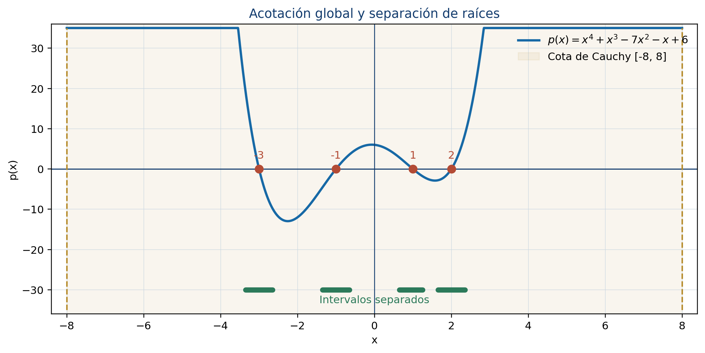
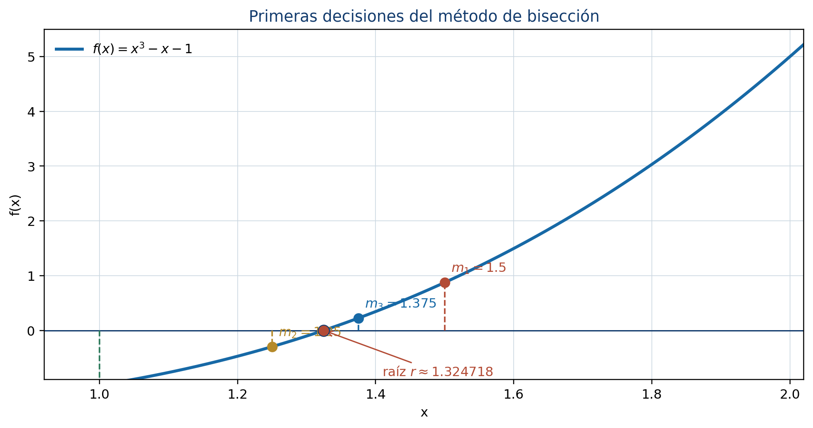

# Métodos numéricos para la estimación de raíces

El Teorema Fundamental del Álgebra garantiza la existencia de raíces complejas, pero un problema computacional exige localizar las raíces reales, separarlas y producir aproximaciones verificables. Este capítulo desarrolla las siete secciones de la Unidad 5 del programa de Álgebra Superior de la Facultad de Ciencias de la UASLP [@uaslp2011]. Cada método se construye primero de manera manual y después se implementa con R base.

## Introducción {.unnumbered .unlisted}

Para

$$
p(x)=a_nx^n+a_{n-1}x^{n-1}+\cdots+a_1x+a_0,
\qquad a_n\ne0,
$$

la búsqueda numérica seguirá esta ruta:

1. **acotar:** reducir $\mathbb R$ a un intervalo finito;
2. **contar:** determinar cuántas raíces reales hay;
3. **separar:** obtener intervalos con una sola raíz;
4. **aproximar:** aplicar un método iterativo;
5. **validar:** revisar tolerancia, error y residuo.

### Objetivos {.unnumbered .unlisted}

Al terminar el capítulo, el lector podrá:

- calcular cotas de raíces con R;
- detectar cambios de signo sin omitir coeficientes cero;
- construir una sucesión de Sturm mediante división de polinomios;
- implementar Descartes y usar Budan-Fourier;
- programar bisección, secante y Newton sin paquetes;
- evaluar simultáneamente $p$ y $p'$ con Horner;
- comparar seguridad, velocidad y costo de los métodos;
- experimentar con tres construcciones auténticas de GeoGebra.

### Convención computacional {.unnumbered .unlisted}

Como en el capítulo 4, un polinomio se representa mediante sus coeficientes en orden descendente. Por ejemplo,

$$
x^3-x-1
$$

se almacena como `c(1, 0, -1, -1)`.

```{.r}
normalizar_coef <- function(coef, tol = 0) {
  coef <- as.numeric(coef)
  while (length(coef) > 1L && abs(coef[1L]) <= tol) {
    coef <- coef[-1L]
  }
  coef
}

evaluar_horner <- function(coef, x) {
  coef <- normalizar_coef(coef)
  valor <- rep(coef[1L], length(x))
  if (length(coef) > 1L) {
    for (a in coef[-1L]) valor <- valor * x + a
  }
  valor
}

derivar_polinomio <- function(coef) {
  coef <- normalizar_coef(coef)
  grado <- length(coef) - 1L
  if (grado == 0L) return(0)
  coef[-length(coef)] * seq(grado, 1L)
}
```

## Materiales complementarios del capítulo

### Video del capítulo

El enlace al video se incorporará cuando esté disponible.

| Material | Descripción | Acceso |
|---|---|---|
| Presentación en PDF | Diapositivas del capítulo para consulta y exposición. | Enlace pendiente |
| Presentación editable | Diapositivas en formato PowerPoint. | Enlace pendiente |
| Infografía | Síntesis visual de los conceptos principales. | Enlace pendiente |
| Cuaderno de Google Colab | Cuaderno completo del capítulo con código y ejercicios en R. | [Abrir en Google Colab](https://colab.research.google.com/github/gilbertorodriguez59/libro-algebra-superior-r-geogebra/blob/main/notebooks/capitulo-05-metodos-raices-R.ipynb){target="_blank"} |

## Acotación de raíces {#sec-acotacion-raices}

La cota de Cauchy establece que toda raíz $z$ satisface

$$
|z|\le R,
\qquad
R=1+\max_{0\le k<n}\left|\frac{a_k}{a_n}\right|.
$$

### Cálculo manual {.unnumbered .unlisted}

Para

$$
p(x)=x^4+x^3-7x^2-x+6,
$$

se obtiene

$$
R=1+\max\{1,7,1,6\}=8.
$$

Por tanto, todas las raíces reales están en $[-8,8]$.

### Implementación en R {.unnumbered .unlisted}

```{.r}
cota_cauchy <- function(coef) {
  coef <- normalizar_coef(coef)
  if (length(coef) == 1L) return(NA_real_)
  1 + max(abs(coef[-1L] / coef[1L]))
}

p4 <- c(1, 1, -7, -1, 6)
R <- cota_cauchy(p4)
c(-R, R)
```

La cota es segura, pero puede ser amplia. Una tabla de valores dentro de $[-R,R]$ ayuda a localizar subintervalos con cambios de signo.

```{.r}
malla <- seq(-R, R, by = 0.5)
tabla_malla <- data.frame(
  x = malla,
  p = evaluar_horner(p4, malla)
)
head(tabla_malla)
```

{#fig-acotacion-separacion width=90% fig-alt="Gráfica de un polinomio con cota global e intervalos que separan sus raíces reales."}

::: {.content-visible when-format="html"}
<iframe class="interactive-frame" src="interactivos/geogebra-localizacion-raices.html" title="GeoGebra: localización y acotación de raíces" loading="lazy"></iframe>

[Abrir la construcción en una página independiente](interactivos/geogebra-localizacion-raices.html){.btn .btn-outline-primary}
:::

### Actividad GeoGebra {.unnumbered .unlisted}

1. Modifique los coeficientes del polinomio desde los deslizadores.
2. Compare la cota $[-R,R]$ con las raíces visibles.
3. Cambie el tamaño de la malla y registre qué intervalos presentan cambio de signo.
4. Construya un ejemplo con una raíz de multiplicidad par y explique por qué no aparece un cambio de signo.

[Descargar la construcción base `.ggb`](https://gilbertorodriguez59.github.io/libro-algebra-superior-r-geogebra/interactivos/geogebra/localizacion-acotacion-raices.ggb){.btn .btn-outline-primary}

## Separación de raíces {#sec-separacion-raices}

Si $p(a)p(b)<0$, la continuidad garantiza al menos una raíz en $(a,b)$. Para detectar automáticamente estos intervalos:

```{.r}
separar_por_signo <- function(coef, a, b, paso = 0.25, tol = 1e-12) {
  x <- seq(a, b, by = paso)
  if (tail(x, 1L) < b) x <- c(x, b)
  y <- evaluar_horner(coef, x)

  exactas <- which(abs(y) <= tol)
  cambios <- which(y[-length(y)] * y[-1L] < 0)

  intervalos <- if (length(cambios)) {
    data.frame(
      izquierda = x[cambios],
      derecha = x[cambios + 1L],
      f_izquierda = y[cambios],
      f_derecha = y[cambios + 1L]
    )
  } else {
    data.frame()
  }

  list(
    raices_en_malla = x[exactas],
    intervalos = intervalos
  )
}

separar_por_signo(p4, -8, 8, paso = 0.4)
```

### Verificar unicidad {.unnumbered .unlisted}

Un cambio de signo demuestra existencia, no unicidad. Si $p'$ no cambia de signo y no se anula en $[a,b]$, entonces $p$ es estrictamente monótona y la raíz es única.

Para $f(x)=x^3-x-1$ se tiene, exactamente,

$$
f'(x)=3x^2-1\geq 2\qquad\text{para }x\in[1,2].
$$

Por tanto, $f$ es estrictamente creciente y la raíz es única. El siguiente cálculo sólo confirma numéricamente esa cota; el muestreo no sustituye la demostración anterior.

```{.r}
fcoef <- c(1, 0, -1, -1)
dfcoef <- derivar_polinomio(fcoef)

c(
  f_1 = evaluar_horner(fcoef, 1),
  f_2 = evaluar_horner(fcoef, 2),
  min_derivada = min(evaluar_horner(dfcoef, seq(1, 2, length.out = 201)))
)
```

El cambio de signo prueba existencia y la desigualdad exacta para la derivada prueba unicidad en $[1,2]$.

::: {.callout-warning title="Limitación del muestreo"}
Una raíz de multiplicidad par puede tocar el eje sin cambiar de signo. Para no omitirla, se deben analizar $p'$ y el máximo común divisor de $p$ con $p'$, o usar un conteo de Sturm después de eliminar factores repetidos.
:::

## Teorema de Sturm {#sec-sturm}

La sucesión de Sturm se define por

$$
p_0=p,\qquad p_1=p',\qquad
p_{k+1}=-\operatorname{residuo}(p_{k-1},p_k).
$$

Si $V(t)$ cuenta las variaciones de signo de los valores de la sucesión en $t$, el número de raíces reales distintas en $(a,b)$ es $V(a)-V(b)$.

### División de polinomios en R base {.unnumbered .unlisted}

```{.r}
dividir_polinomios <- function(dividendo, divisor, tol = 1e-12) {
  dividendo <- normalizar_coef(dividendo, tol)
  divisor <- normalizar_coef(divisor, tol)
  if (length(divisor) == 1L && abs(divisor) <= tol) {
    stop("El divisor no puede ser el polinomio cero.")
  }

  grado_a <- length(dividendo) - 1L
  grado_b <- length(divisor) - 1L
  if (grado_a < grado_b) {
    return(list(cociente = 0, residuo = dividendo))
  }

  residuo <- dividendo
  cociente <- numeric(grado_a - grado_b + 1L)

  for (i in seq_along(cociente)) {
    factor <- residuo[i] / divisor[1L]
    cociente[i] <- factor
    residuo[i:(i + grado_b)] <-
      residuo[i:(i + grado_b)] - factor * divisor
  }

  residuo[abs(residuo) <= tol] <- 0
  resto <- if (grado_b == 0L) 0 else tail(residuo, grado_b)
  list(
    cociente = normalizar_coef(cociente, tol),
    residuo = normalizar_coef(resto, tol)
  )
}

cambios_signo <- function(valores, tol = 1e-10) {
  valores <- valores[abs(valores) > tol]
  if (length(valores) < 2L) return(0L)
  sum(valores[-1L] * valores[-length(valores)] < 0)
}
```

### Construcción de la sucesión {.unnumbered .unlisted}

```{.r}
sucesion_sturm <- function(coef, tol = 1e-10) {
  p0 <- normalizar_coef(coef, tol)
  p1 <- normalizar_coef(derivar_polinomio(p0), tol)
  sucesion <- list(p0, p1)

  while (length(sucesion[[length(sucesion)]]) > 1L) {
    n <- length(sucesion)
    r <- dividir_polinomios(sucesion[[n - 1L]], sucesion[[n]], tol)$residuo
    r <- normalizar_coef(-r, tol)
    if (length(r) == 1L && abs(r) <= tol) break
    sucesion[[n + 1L]] <- r
  }
  sucesion
}

variaciones_sturm <- function(sucesion, x, tol = 1e-10) {
  valores <- vapply(sucesion, evaluar_horner, numeric(1), x = x)
  cambios_signo(valores, tol)
}

contar_raices_sturm <- function(coef, a, b, tol = 1e-10) {
  if (a >= b) stop("Se requiere a < b.")
  if (abs(evaluar_horner(coef, a)) <= tol ||
      abs(evaluar_horner(coef, b)) <= tol) {
    stop("Los extremos del intervalo no deben ser raíces del polinomio.")
  }
  s <- sucesion_sturm(coef, tol)
  variaciones_sturm(s, a, tol) - variaciones_sturm(s, b, tol)
}

sturm_x3_x <- sucesion_sturm(c(1, 0, -1, 0))
sturm_x3_x
contar_raices_sturm(c(1, 0, -1, 0), -2, 2)
```

El resultado es `3`, que coincide con las raíces $-1$, $0$ y $1$. Para raíces múltiples debe trabajarse con la parte libre de cuadrados del polinomio.

### Separación certificada {.unnumbered .unlisted}

Una estrategia robusta subdivide $[-R,R]$ y conserva los intervalos donde Sturm cuenta exactamente una raíz. A diferencia del simple cambio de signo, este procedimiento también detecta intervalos asociados a raíces pares cuando se ha preparado correctamente el polinomio.

## Regla de los signos de Descartes {#sec-descartes}

Los coeficientes cero se eliminan antes de contar variaciones. El número de raíces positivas es el número de variaciones de $p(x)$ o ese número menos un entero par. Para las negativas se usa $p(-x)$.

```{.r}
coef_p_menos_x <- function(coef) {
  coef <- normalizar_coef(coef)
  grado <- length(coef) - 1L
  coef * (-1) ^ seq(grado, 0L)
}

posibilidades_descartes <- function(variaciones) {
  seq(variaciones, 0L, by = -2L)
}

descartes <- function(coef) {
  vp <- cambios_signo(coef)
  vn <- cambios_signo(coef_p_menos_x(coef))
  list(
    variaciones_positivas = vp,
    posibles_positivas = posibilidades_descartes(vp),
    variaciones_negativas = vn,
    posibles_negativas = posibilidades_descartes(vn)
  )
}

descartes(p4)
```

Para `p4` aparecen las posibilidades $2$ o $0$ en ambos signos. Sturm puede resolver la ambigüedad contando exactamente las raíces en $(-R,0)$ y $(0,R)$.

```{.r}
c(
  negativas = contar_raices_sturm(p4, -R, -1e-8),
  positivas = contar_raices_sturm(p4, 1e-8, R)
)
```

### Budan-Fourier {.unnumbered .unlisted}

Budan-Fourier cuenta variaciones en

$$
p(t),p'(t),\ldots,p^{(n)}(t).
$$

La diferencia entre las variaciones en $a$ y $b$ es una cota superior para el número de raíces en $(a,b]$ y difiere del número real por un entero par.

```{.r}
variaciones_budan <- function(coef, x, tol = 1e-10) {
  valores <- numeric(0)
  actual <- normalizar_coef(coef)
  repeat {
    valores <- c(valores, evaluar_horner(actual, x))
    if (length(actual) == 1L) break
    actual <- derivar_polinomio(actual)
  }
  cambios_signo(valores, tol)
}

cota_budan <- function(coef, a, b) {
  variaciones_budan(coef, a) - variaciones_budan(coef, b)
}

cota_budan(p4, -4, 0)
```

Descartes y Budan-Fourier filtran posibilidades; Sturm certifica el conteo exacto.

## Estimación mediante bisección {#sec-biseccion}

En cada paso se calcula el punto medio y se conserva la mitad con cambio de signo.

### Algoritmo en R {.unnumbered .unlisted}

```{.r}
biseccion <- function(coef, a, b, tol = 1e-8, max_iter = 100L) {
  fa <- evaluar_horner(coef, a)
  fb <- evaluar_horner(coef, b)
  if (abs(fa) <= tol) return(data.frame(iter = 0L, a = a, b = a, x = a, fx = fa, error = 0))
  if (abs(fb) <= tol) return(data.frame(iter = 0L, a = b, b = b, x = b, fx = fb, error = 0))
  if (fa * fb > 0) stop("Los extremos deben tener signos opuestos.")

  historial <- vector("list", max_iter)
  for (k in seq_len(max_iter)) {
    m <- (a + b) / 2
    fm <- evaluar_horner(coef, m)
    error <- (b - a) / 2
    historial[[k]] <- data.frame(iter = k, a = a, b = b, x = m, fx = fm, error = error)

    if (abs(fm) <= tol || error <= tol) break
    if (fa * fm < 0) {
      b <- m
      fb <- fm
    } else {
      a <- m
      fa <- fm
    }
  }
  do.call(rbind, historial[seq_len(k)])
}

hist_bis <- biseccion(fcoef, 1, 2, tol = 1e-8)
head(hist_bis, 6)
tail(hist_bis, 1)
```

{#fig-biseccion width=86% fig-alt="Gráfica que muestra las primeras reducciones de un intervalo mediante bisección."}

::: {.content-visible when-format="html"}
<iframe class="interactive-frame" src="interactivos/geogebra-biseccion.html" title="GeoGebra: método de bisección" loading="lazy"></iframe>

[Abrir la construcción en una página independiente](interactivos/geogebra-biseccion.html){.btn .btn-outline-primary}
:::

### Actividad GeoGebra {.unnumbered .unlisted}

1. Inicie con $[1,2]$ para $x^3-x-1$.
2. Avance una iteración a la vez y anote el intervalo conservado.
3. Compare la longitud visual con $(b_0-a_0)/2^n$.
4. Descargue el archivo `.ggb` y cambie el polinomio.

[Descargar la construcción base `.ggb`](https://gilbertorodriguez59.github.io/libro-algebra-superior-r-geogebra/interactivos/geogebra/metodo-biseccion.ggb){.btn .btn-outline-primary}

## Estimación mediante el método de la secante {#sec-secante}

La fórmula es

$$
x_{n+1}=x_n-f(x_n)
\frac{x_n-x_{n-1}}{f(x_n)-f(x_{n-1})}.
$$

### Implementación {.unnumbered .unlisted}

```{.r}
secante <- function(coef, x0, x1, tol = 1e-8, max_iter = 100L) {
  f0 <- evaluar_horner(coef, x0)
  f1 <- evaluar_horner(coef, x1)
  historial <- vector("list", max_iter)

  for (k in seq_len(max_iter)) {
    denominador <- f1 - f0
    if (abs(denominador) <= .Machine$double.eps) {
      stop("La pendiente de la secante es numéricamente nula.")
    }
    x2 <- x1 - f1 * (x1 - x0) / denominador
    f2 <- evaluar_horner(coef, x2)
    cambio <- abs(x2 - x1)
    historial[[k]] <- data.frame(iter = k, x = x2, fx = f2, cambio = cambio)

    if (abs(f2) <= tol || cambio <= tol) break
    x0 <- x1
    f0 <- f1
    x1 <- x2
    f1 <- f2
  }
  do.call(rbind, historial[seq_len(k)])
}

hist_sec <- secante(fcoef, 1, 2, tol = 1e-10)
hist_sec
```

La secante suele necesitar menos iteraciones que la bisección y no utiliza derivadas. A cambio, no conserva un intervalo seguro y puede fallar si los valores funcionales son casi iguales.

## Estimación mediante el método de Newton {#sec-newton}

Newton usa la tangente:

$$
x_{n+1}=x_n-\frac{p(x_n)}{p'(x_n)}.
$$

### Horner simultáneo para $p$ y $p'$ {.unnumbered .unlisted}

```{.r}
horner_valor_derivada <- function(coef, x) {
  coef <- normalizar_coef(coef)
  grado <- length(coef) - 1L
  if (grado == 0L) return(c(valor = coef, derivada = 0))

  b <- coef[1L]
  caux <- b
  if (grado > 1L) {
    for (i in 2L:grado) {
      b <- coef[i] + x * b
      caux <- b + x * caux
    }
  }
  b <- coef[length(coef)] + x * b
  c(valor = unname(b), derivada = unname(caux))
}

horner_valor_derivada(fcoef, 1.5)
```

### Newton-Horner en R {.unnumbered .unlisted}

```{.r}
newton_horner <- function(coef, x0, tol = 1e-8, max_iter = 100L, multiplicidad = 1) {
  historial <- vector("list", max_iter)

  for (k in seq_len(max_iter)) {
    vd <- horner_valor_derivada(coef, x0)
    valor <- vd[["valor"]]
    derivada <- vd[["derivada"]]
    if (abs(derivada) <= .Machine$double.eps) {
      stop("La derivada es numéricamente nula.")
    }
    x1 <- x0 - multiplicidad * valor / derivada
    f1 <- evaluar_horner(coef, x1)
    cambio <- abs(x1 - x0)
    historial[[k]] <- data.frame(iter = k, x = x1, fx = f1, cambio = cambio)

    if (abs(f1) <= tol || cambio <= tol) break
    x0 <- x1
  }
  do.call(rbind, historial[seq_len(k)])
}

hist_newton <- newton_horner(fcoef, 1.5, tol = 1e-12)
hist_newton
```

{#fig-secante-newton width=92% fig-alt="Comparación geométrica entre una recta secante y la tangente utilizada por el método de Newton."}

::: {.content-visible when-format="html"}
<iframe class="interactive-frame" src="interactivos/geogebra-secante-newton.html" title="GeoGebra: comparación entre secante y Newton" loading="lazy"></iframe>

[Abrir la construcción en una página independiente](interactivos/geogebra-secante-newton.html){.btn .btn-outline-primary}
:::

### Actividad GeoGebra {.unnumbered .unlisted}

1. Desplace los puntos iniciales de la secante y observe su intersección con el eje.
2. Desplace el punto inicial de Newton y compare la tangente.
3. Localice una posición donde la derivada sea pequeña.
4. Explique por qué la construcción predice un paso de Newton muy grande.

[Descargar la construcción base `.ggb`](https://gilbertorodriguez59.github.io/libro-algebra-superior-r-geogebra/interactivos/geogebra/secante-newton.ggb){.btn .btn-outline-primary}

### Raíz múltiple {.unnumbered .unlisted}

Para $p(x)=(x-1)^4$, Newton ordinario converge lentamente. Si se conoce $m=4$, use:

```{.r}
raiz_multiple <- c(1, -4, 6, -4, 1)
newton_horner(raiz_multiple, 2, tol = 1e-12, multiplicidad = 1)
newton_horner(raiz_multiple, 2, tol = 1e-12, multiplicidad = 4)
```

La versión modificada incorpora la multiplicidad y puede recuperar convergencia cuadrática.

## Comparación reproducible {.unnumbered .unlisted}

```{.r}
resumen_metodos <- data.frame(
  metodo = c("Bisección", "Secante", "Newton-Horner"),
  iteraciones = c(nrow(hist_bis), nrow(hist_sec), nrow(hist_newton)),
  aproximacion = c(tail(hist_bis$x, 1), tail(hist_sec$x, 1), tail(hist_newton$x, 1)),
  residuo = abs(c(tail(hist_bis$fx, 1), tail(hist_sec$fx, 1), tail(hist_newton$fx, 1)))
)
resumen_metodos
```

| Método | Requisito | Fortaleza | Riesgo |
|---|---|---|---|
| Bisección | intervalo con cambio de signo | garantía y cota de error | convergencia lineal |
| Secante | dos aproximaciones | evita derivadas | denominador pequeño o alejamiento |
| Newton-Horner | punto inicial y derivada | convergencia cuadrática local | derivada pequeña o inicio inadecuado |

## Laboratorio del capítulo {.unnumbered .unlisted}

Trabaje con

$$
p(x)=x^5-3x^4-3x^3+11x^2-6x.
$$

1. Calcule la cota de Cauchy.
2. Use Descartes para las posibilidades positivas y negativas.
3. Aplique Sturm para contar raíces en $(-R,0)$ y $(0,R)$.
4. Separe cada raíz en un intervalo.
5. Aproxime cada una con bisección, secante y Newton-Horner.
6. Compare iteraciones y residuos con una misma tolerancia.
7. Represente el polinomio en la construcción GeoGebra de localización.
8. Documente un caso donde un método abierto necesite cambiar sus datos iniciales.

::: {.content-visible when-format="html"}
[Abrir el cuaderno completo del capítulo 5 en Google Colab](https://colab.research.google.com/github/gilbertorodriguez59/libro-algebra-superior-r-geogebra/blob/main/notebooks/capitulo-05-metodos-raices-R.ipynb){.btn .btn-primary}

[Descargar el cuaderno](https://gilbertorodriguez59.github.io/libro-algebra-superior-r-geogebra/notebooks/capitulo-05-metodos-raices-R.ipynb){.btn}
:::

## Errores frecuentes {.unnumbered .unlisted}

- Omitir coeficientes cero y alterar el grado del polinomio.
- Usar una cota como si fuera una raíz aproximada.
- Concluir unicidad a partir de un cambio de signo.
- Suponer que una malla fina detecta todas las raíces.
- Contar ceros como cambios de signo en Descartes o Sturm.
- Aplicar bisección sin comprobar signos opuestos.
- Ignorar un denominador casi nulo en secante.
- Continuar Newton cuando la derivada es demasiado pequeña.
- Confundir un residuo pequeño con una cota automática del error;
- comparar métodos con tolerancias o criterios de paro diferentes.

## Ejercicios graduados {.unnumbered .unlisted}

### Nivel 1 {.unnumbered .unlisted}

1. Use `cota_cauchy()` con $2x^4-3x^2+7x-5$.
2. Verifique las posibilidades de Descartes para $x^5-2x^4+x^2-3$.
3. Ejecute seis iteraciones de bisección para $x^3-2$ en $[1,2]$.
4. Grafique el historial de error de bisección en escala logarítmica.

### Nivel 2 {.unnumbered .unlisted}

5. Use `sucesion_sturm()` para $x^3-x$ y explique cada polinomio de la lista.
6. Separe las cuatro raíces de $x^4-5x^2+4$.
7. Compare secante y Newton-Horner para $x^3-x-1$ con tolerancia $10^{-10}$.
8. Modifique `biseccion()` para registrar el número de evaluaciones funcionales.

### Nivel 3 {.unnumbered .unlisted}

9. Programe una rutina que subdivida $[-R,R]$ hasta obtener intervalos con conteo de Sturm igual a uno.
10. Implemente Newton con protección: si el paso sale del intervalo, use una bisección.
11. Estudie la convergencia de Newton ordinario y modificado para $(x-1)^m$, con $m=2,3,4$.
12. Diseñe una prueba automática que compare las raíces encontradas con `polyroot()` sin usarlo como justificación teórica.

## Proyecto integrador {.unnumbered .unlisted}

Elija un polinomio real de grado entre $4$ y $7$ con al menos tres raíces reales. Construya un informe reproducible que incluya cota, Descartes, Sturm, separación, bisección, secante, Newton-Horner, tablas de iteraciones, gráfica del error y una exploración GeoGebra. Todas las funciones deben usar R base y todos los resultados numéricos deben acompañarse de tolerancia y residuo.

## Síntesis {.unnumbered .unlisted}

La estimación confiable de raíces es un proceso, no una fórmula única. Cauchy y la malla delimitan la búsqueda; Descartes y Budan-Fourier reducen posibilidades; Sturm cuenta; bisección aporta seguridad; secante evita derivadas; Newton-Horner aprovecha la estructura polinómica para lograr rapidez. R permite conservar todo el historial de cálculo y GeoGebra hace visible la geometría de cada iteración.

## Referencias del capítulo {.unnumbered .unlisted}

La secuencia temática sigue @uaslp2011. La teoría de raíces y polinomios se apoya en @cardenas1999 y @kurosh1987. Los algoritmos y criterios numéricos siguen @burdenFaires2011 y @chapraCanale2015. El código utiliza R base [@rCore2026] y las construcciones web emplean la incrustación y la API oficiales de GeoGebra [@geogebraEmbedding2026; @geogebraAPI2026].
